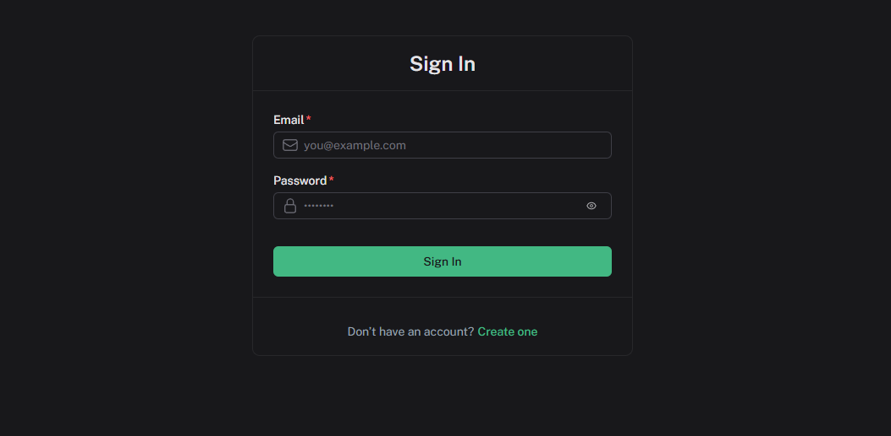
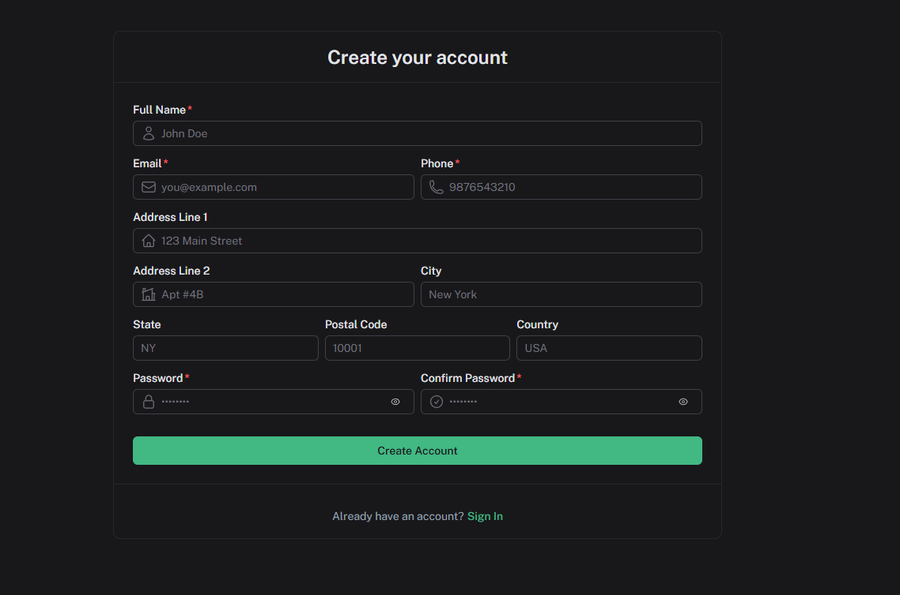
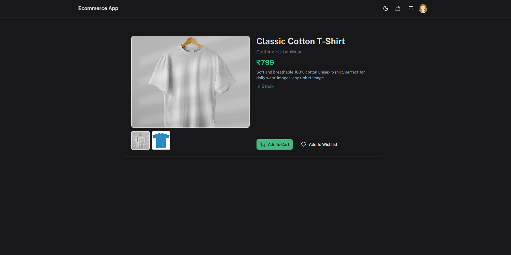
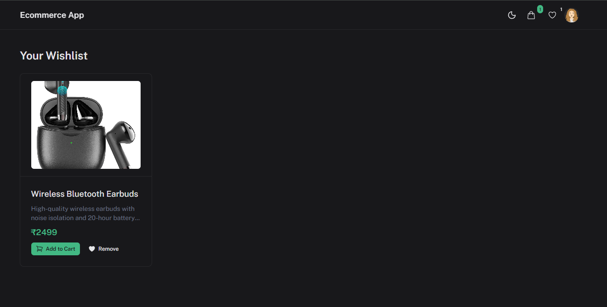
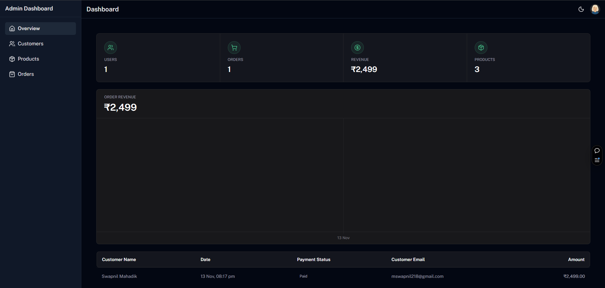
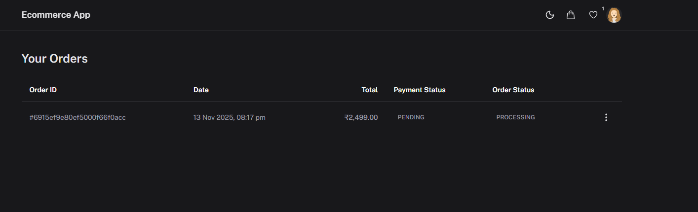
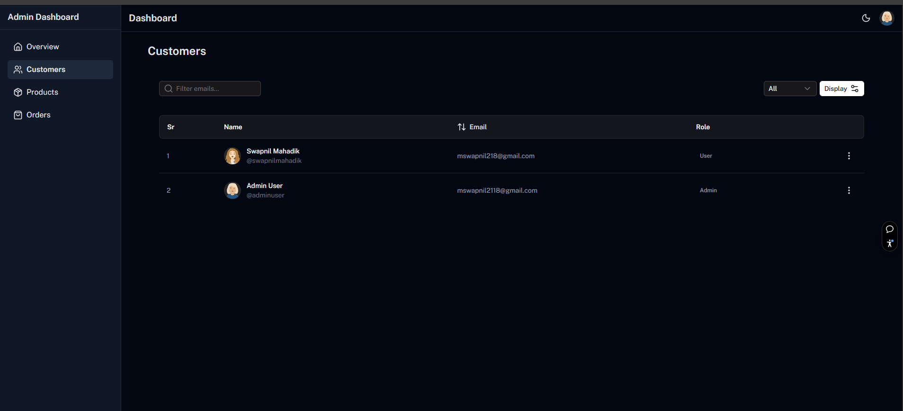

# E-commerce Application (Vue + Express + MongoDB)

This is a full-stack e-commerce web application built using **Vue.js**, **Express.js**, and **MongoDB**.

## Features

### User Features

-   **User Authentication:** Secure user registration and login functionality.
-   **Product Catalog:** Browse and search for products with detailed descriptions and images.
-   **Shopping Cart:** Add products to a cart and manage cart items.
-   **Wishlist:** Save products to a wishlist for future purchase.
-   **Checkout Process:** A seamless and secure checkout process.
-   **Order History:** View past orders and their statuses.
-   **User Profile:** Manage personal information and shipping addresses.

### Admin Dashboard Features

-   **Dashboard Overview:** A comprehensive overview of key metrics such as total sales, orders, and users.
-   **Product Management:** Add, edit, and delete products from the catalog.
-   **Order Management:** View and manage customer orders, update order statuses, and track shipments.
-   **User Management:** Manage user accounts and roles.
-   **Analytics:** View sales reports and other relevant analytics.

## Folder Structure

The project is organized into two main directories: `client` and `server`.

### Frontend (Vue.js)

The `client` directory contains the Vue.js frontend application.

```
/client
|-- /src
|   |-- /assets
|   |-- /components
|   |-- /layouts
|   |-- /pages
|   |-- /router
|   |-- /store
|   |-- App.vue
|   |-- main.ts
|-- package.json
|-- vite.config.ts
```

### Backend (Node.js)

The `server` directory contains the Node.js backend application.

```
/server
|-- /src
|   |-- /config
|   |-- /controllers
|   |-- /middleware
|   |-- /models
|   |-- /routes
|   |-- /utils
|   |-- server.js
|-- package.json
```

## Installation

### Prerequisites

-   [Node.js](https://nodejs.org/) (v14 or higher)
-   [MongoDB](https://www.mongodb.com/try/download/community)

### Backend Setup

1.  Navigate to the `server` directory:
    ```bash
    cd server
    ```
2.  Install the dependencies:
    ```bash
    npm install
    ```
3.  Create a `.env` file in the `server` directory and add the following environment variables:
    ```
    MONGO_URI=<your_mongodb_connection_string>
    JWT_SECRET=<your_jwt_secret>
    JWT_EXPIRES_IN=1d
    CLOUDINARY_CLOUD_NAME=<your_cloudinary_cloud_name>
    CLOUDINARY_API_KEY=<your_cloudinary_api_key>
    CLOUDINARY_API_SECRET=<your_cloudinary_api_secret>
    ```
4.  Start the development server:
    ```bash
    npm run dev
    ```

### Frontend Setup

1.  Navigate to the `client` directory:
    ```bash
    cd client
    ```
2.  Install the dependencies:
    ```bash
    npm install
    ```
3.  Create a `.env.local` file in the `client` directory and add the following environment variable:
    ```
    VITE_API_BASE_URL=http://localhost:5000/api/v1
    ```
4.  Start the development server:
    ```bash
    npm run dev
    ```

## Live URLs

-   **Frontend:** [https://ecommerce-app-vue.vercel.app/](https://ecommerce-app-vue.vercel.app/)
-   **Backend:** [https://vue-ecommerce-app-eaos.onrender.com/api/v1/](https://vue-ecommerce-app-eaos.onrender.com/api/v1/)

## Screenshots

### Home Page


### Login Page



### Sign Up Page



### Product Details



### Shopping Cart


### Wishlist Page



### Add Product


### Edit Product


### Admin Dashboard




### Product Management


### Orders Page



### Dashboard (User)



### Settings Page


### Profile Page


